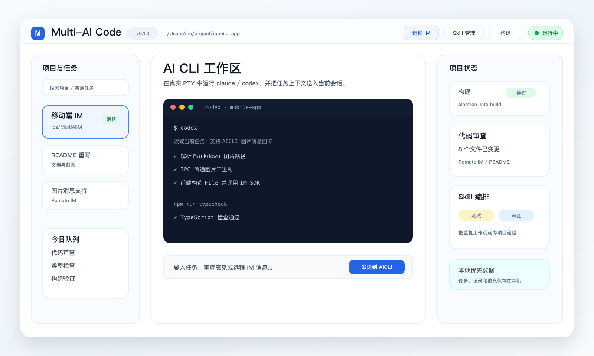
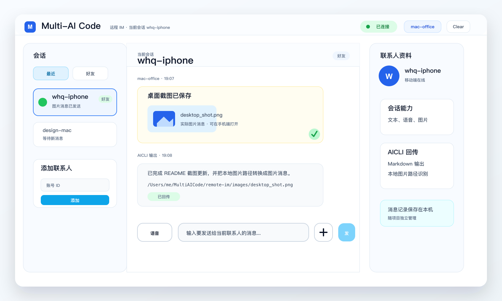
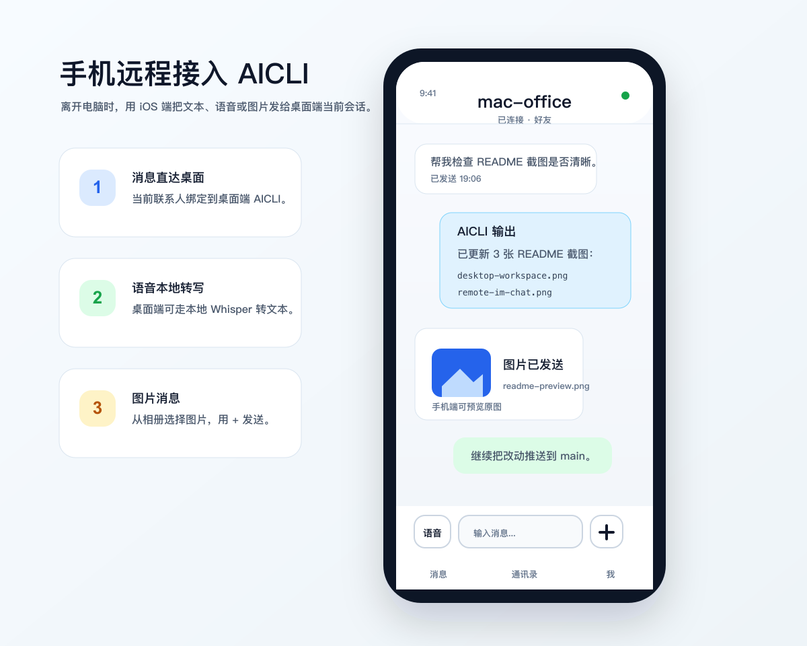

# Multi-AI Code

> 本地优先的 AI CLI 工作台：围绕一个本地仓库组织任务、终端、代码审查、构建运行、Skill 编排和远程 IM，并调用你本机真实安装的 `codex` / `claude` 完成开发工作。

<p align="center">
  
</p>

## 它是什么

Multi-AI Code 是一个面向个人开发者的桌面工作台。它不内置大模型，也不替代 Codex 或 Claude Code，而是把本机 AI CLI、仓库上下文、任务文档、审查反馈、构建运行配置和远程消息入口放到同一个应用里。

下文的 AICLI 指可以从命令行启动的 AI 编程工具，例如 `codex` 和 `claude`。当前默认推荐使用 Codex；Claude Code 仍保留为可选项，但不建议作为默认 CLI。

你可以用它做这些事：

- 打开一个本地仓库，绑定当前项目的任务、配置和分析记忆。
- 在真实 PTY 终端里启动 AICLI，并向当前会话发送任务、文件路径、审查意见或远程消息。
- 管理普通任务和定时任务，让重复工作按项目沉淀下来。
- 在桌面端完成代码审查、仓库查看、项目构建、项目运行和日志分析。
- 管理本机 Skills，把多个 Skill 编排成可复用流程。
- 通过 iOS 远程 IM 从手机把文本、图片、语音或任务发送到桌面端当前 AICLI。

## 为什么使用它

- 仓库上下文集中：任务文档、构建命令、运行命令、审查批注和分析记忆都围绕当前仓库组织。
- AI CLI 不被封装黑盒：应用启动的仍然是你本机真实安装、已登录的 `codex` 或 `claude`。
- 开发工作流闭环：从任务描述、AI 会话、diff 审查到构建运行，都能在一个桌面应用内衔接。
- Skill 可沉淀：本机已有 Skill 可以扫描、启用、查看，也可以通过编排面板组合成项目级流程。
- 手机可接入：离开电脑时，可以用 iOS 客户端给桌面端当前会话发消息，并查看回传结果。
- 数据本地优先：项目数据、消息记录、运行记录和 Skill 状态默认保存在本机或目标仓库目录。

## 界面预览

### 桌面工作台



### 远程 IM



### iOS 远程会话



## 核心工作流

### AI CLI 工作区

桌面端中间区域是一个真实 PTY 终端。应用负责选择项目、启动 AICLI、注入任务上下文和展示输出，实际推理与代码修改仍由本机 CLI 完成。

支持的能力：

- 默认选择 `codex` 作为当前项目的执行工具；如需兼容旧流程，也可以手动切到 `claude`。
- 继续上一次会话，或者为新的任务打开新会话。
- 拖拽文件到终端后插入路径。
- 以 Markdown 风格展示长文本输出，便于阅读计划、说明和审查结果。
- 把普通任务、定时任务、代码审查批注、仓库分析片段和远程 IM 消息发送给当前会话。

### 任务与定时任务

普通任务用于描述一次明确的开发目标，定时任务用于按计划触发重复工作。

- 普通任务文档保存在 `<target_repo>/.multi-ai-code/designs/`。
- 任务列表、任务描述和 UI 展示信息保存在项目元数据里。
- 可以从外部 Markdown 导入任务。
- 定时任务按项目保存到本机 SQLite，支持启用、禁用、立即运行和查看运行记录。
- 定时任务进入专门的发送队列，避免和普通交互混在一起。

### 代码审查与仓库查看

代码审查窗口面向当前改动、最近提交或指定 commit，适合把 diff 批注发回 AICLI 继续修正。

- 双栏查看 diff 和批注。
- 支持对单行或多行代码写审查意见。
- 批注可以发送回当前 AI 会话。
- 定时任务上下文下会限制部分交互，避免误把审查意见混入错误任务。

仓库查看窗口用于浏览和分析代码。

- 左侧文件树，中间源码，右侧分析对话和标注列表。
- 自动过滤 `.git`、`node_modules`、`dist`、`build`、`out` 等大目录。
- 可以选中代码片段创建标注，再发给独立分析会话。
- 分析结果可以写入仓库目录，方便下次打开同一仓库时恢复上下文。

### 构建、运行与日志

每个项目可以维护自己的构建流程和运行流程。

- 构建步骤可以顺序执行，也可以单独执行某一步。
- Windows 支持 MSYS / Visual Studio 相关环境选择。
- macOS 使用原始环境，不展示 Windows 专用配置。
- 运行配置和构建配置跟项目走。
- 运行日志可以在桌面端查看，并交给 AICLI 分析。

### Skill、编排与习惯沉淀

Skill 系统用于把可复用的工作方法显式沉淀下来。

- Skill 管理可以扫描本机 Skill 来源，展示名称、描述、来源路径和启用状态。
- Prompt 模板用于保存常用输入片段。
- Skill 编排可以把多个 Skill 组合成项目级流程，并保存到 `<target_repo>/.multi-ai-code/skill-pipelines/`。
- 习惯监控会采集应用内操作事件，聚合出候选流程和可复用线索，帮助把重复操作沉淀成 Skill 或编排流程。
- 项目级 Skills 可以放在 `<target_repo>/.multi-ai-code/skills/`，随项目一起管理。

### 远程 IM、iOS 与语音

远程 IM 基于应用内 IM 通道，用于把手机或另一端的消息转发到桌面端当前 AICLI。

桌面端能力：

- 使用用户 ID 登录，当前使用应用内置测试通信配置。
- 远程 IM 抽屉支持会话列表、联系人列表、添加联系人、删除联系人和清空消息。
- 联系人发来的文本、图片和语音消息可以记录到当前会话，并按需发送给当前 AICLI。
- AICLI 输出会清理成更适合聊天阅读的 Markdown，再回传给对应联系人。
- 本地 bridge 会生成带 token 的 `imcli` 配置，方便 AICLI 主动查询、发送文本或发送图片。

iOS 客户端能力：

- SwiftUI App，底部为 `消息 / 通讯录 / 我` 三栏。
- 登录时只需要填写用户 ID，通信配置使用应用内置测试配置。
- 支持文本消息、图片消息、联系人管理、本地聊天历史和语音消息。
- 进入已有会话时会自动定位到最新消息。
- 语音消息可在本端播放；桌面端收到语音后可走本地 Whisper 转文字，再把文本交给 AICLI。

`imcli` 常用命令：

```bash
imcli help
imcli whoami --project <projectId>
imcli contacts --project <projectId>
imcli history --project <projectId> --peer <userId> --limit 20
imcli last --project <projectId> --peer <userId>
imcli send <userId> "消息内容" --project <projectId>
imcli send-image <userId> /path/to/image.png --project <projectId>
imcli forward <userId> --message-id <id> --project <projectId>
imcli broadcast <user1,user2> "消息内容" --project <projectId>
```

## 工作方式

```text
Electron Desktop
  React renderer              桌面 UI、终端、任务、审查、仓库查看、Skill 面板
  Electron main / preload     SQLite、PTY、任务队列、构建运行、IM 路由、ASR
  bin/imcli*                  给 AICLI 调用的本地 IM 命令

iOS Remote IM
  SwiftUI App                 消息、通讯录、设置、文本、图片和语音发送
  IM iOS SDK                  远程消息收发

Local Data
  ~/MultiAICode/              桌面端全局数据
  <target_repo>/.multi-ai-code 仓库级任务、Skill、分析记忆
```

几个关键原则：

- AICLI 是外部工具，必须由用户在本机安装和登录。
- 桌面端只把任务、上下文和远程消息送入当前 AI 会话，不直接执行远程发来的 shell 命令。
- IM 账号、消息记录、定时任务和运行记录默认保存在本机。
- 仓库级任务、Skill 编排和仓库分析记忆放在目标仓库的 `.multi-ai-code` 目录。

## 数据归属

| 数据 | 默认位置 | 说明 |
| --- | --- | --- |
| 项目列表和项目元数据 | `~/MultiAICode/projects/<projectId>/project.json` | 项目名、目标仓库、构建运行配置、远程 IM 开关等 |
| SQLite 数据库 | `~/MultiAICode/multi-ai-code.db` | 消息、定时任务、运行记录、习惯事件、候选流程等 |
| 普通任务文档 | `<target_repo>/.multi-ai-code/designs/` | 跟仓库走，便于随项目迁移 |
| Skill 编排 | `<target_repo>/.multi-ai-code/skill-pipelines/` | 项目级流程定义 |
| 项目级 Skills | `<target_repo>/.multi-ai-code/skills/` | 项目自带 Skill 来源 |
| 仓库查看分析 | `<target_repo>/.multi-ai-code/repo-view/analyses/` | 仓库分析记忆和片段结果 |
| 远程 IM 账号 | `~/MultiAICode/remote-im-profiles/<profile>/remote-im-account.json` | 用户 ID、联系人等本机配置 |
| imcli bridge | `~/MultiAICode/imcli-bridge.json` | 桌面端运行时生成，带本地访问 token |
| ASR 运行资源 | `resources/asr` | 打包时写入安装包资源目录 |

建议把目标仓库里的 `.multi-ai-code/` 加入忽略规则，除非你明确希望把任务文档、Skill 或分析记忆提交到仓库。

## 快速开始

环境要求：

- Node.js 20+
- macOS 或 Windows
- 本机至少安装并登录一种 AI CLI：
  - `codex`
  - `claude`（可选，不建议默认使用）
- 也可以从源码构建内置的 `codex` / `opencode`，见下文「内置 AICLI 编译」


桌面端开发启动：

```bash
npm install
npm run dev
```

桌面端构建：

```bash
npm run build
```

如果本机在 Electron 和 Node 测试环境之间切换后遇到 native 模块 ABI 报错，可以重建相关依赖：

```bash
npm rebuild better-sqlite3 node-pty
```

## 内置 AICLI 编译（codex / opencode）

除了调用本机安装的 AI CLI，应用也可以使用从源码构建的内置 `codex` 和 `opencode`。两者以 git submodule 形式放在 `third_party/aicli/`，产物输出到 `bin/aicli/<工具>/<平台>/`，并在 `bin/aicli/manifest.json` 记录来源 commit 和版本。

首次拉取代码后先初始化子模块：

```bash
git submodule update --init --recursive
```

### 工具链要求

| 子模块 | 技术栈 | 需要安装 |
| --- | --- | --- |
| codex | Rust workspace（`codex-rs/`） | Rust 工具链（Windows 用 `stable-msvc`，需 VS Build Tools 提供链接器） |
| opencode | Bun/TypeScript monorepo | Bun ≥ 1.3.14（脚本会自动回退到 `bunx bun@1.3.14`） |

### 构建命令

```bash
# 一次构建两个：
npm run build:aicli

# 或者分别构建：
node scripts/build-aicli-codex.mjs
node scripts/build-aicli-opencode.mjs
```

- codex 走 `cargo build`（debug 档）。首次全量编译耗时较长，`codex-rs/target/` 缓存命中后增量重编只需数秒。
- opencode 会先做 Web UI 生产构建并嵌入二进制，再用 `bun build --compile` 打成约 160MB 的自包含可执行文件，自带 `--version` 冒烟测试。
- 内置构建的版本号形如 `0.0.0-dev-<时间戳>`；应用启动 opencode 时会自动注入 `OPENCODE_DISABLE_AUTOUPDATE=1`，不会因为版本号低于官方 release 弹升级提示。

### Windows 已知问题与解法

- **找不到 `cargo` / `bun`**：确认 `%USERPROFILE%\.cargo\bin` 在 PATH 里；npm 全局安装的 bun 是 `.cmd` 垫片，构建脚本的 `spawnSync` 无法直接执行，需要把真实 exe 所在目录（`%APPDATA%\npm\node_modules\bun\bin`）放到 PATH 前面。
- **`bun build --compile` 长时间无进展**：它需要下载 `@oven/bun-windows-x64` 运行时（约 100MB）作为拼装模板，国内直连 npm 官方源可能极慢。设置镜像后重试，下载一次后即有缓存：

  ```powershell
  $env:NPM_CONFIG_REGISTRY = "https://registry.npmmirror.com"
  ```

- **`bun install` 报 `EPERM (NtSetInformationFile)`**：杀毒软件扫描新下载的 exe 时锁文件所致。失败的包（workerd / sst / pagefind 等）都是其他工作区的开发依赖，不影响 opencode 本体打包；也可以把 `%USERPROFILE%\.bun\install\cache` 加入杀软排除目录后重试。
- **向 opencode 子模块推送时 pre-push typecheck 失败**（`custom-elements.d.ts` 报 TS1128）：该仓库包含 git symlink，Windows 默认把它们检出成路径文本文件。开启系统开发者模式后，在子模块里执行：

  ```bash
  git config core.symlinks true
  # 删除受影响文件后重新检出即可恢复为真实符号链接
  ```

## 桌面 Qt IM 客户端编译

独立的 Qt5 桌面 IM 客户端位于 `desktop/qt-im/`（CMake 工程，Windows/macOS）。构建、运行与原生 IM SDK 说明见 [desktop/qt-im/README.md](desktop/qt-im/README.md)。

## iOS 远程 IM

iOS 工程位于：

```text
ios/MultiAIIM/MultiAIIM.xcworkspace
```

如果本地没有 CocoaPods 依赖目录，先执行：

```bash
cd ios/MultiAIIM
pod install
cd ../..
```

模拟器构建：

```bash
xcodebuild build \
  -workspace ios/MultiAIIM/MultiAIIM.xcworkspace \
  -scheme MultiAIIM \
  -destination 'platform=iOS Simulator,name=iPhone 16'
```

iOS Core 测试：

```bash
xcodebuild test \
  -workspace ios/MultiAIIM/MultiAIIM.xcworkspace \
  -scheme MultiAIIMCoreTests \
  -destination 'platform=iOS Simulator,name=iPhone 16'
```

真机构建需要本机 Xcode 已登录有效开发者账号，并替换自己的 Team ID 和设备 ID：

```bash
xcodebuild build \
  -workspace ios/MultiAIIM/MultiAIIM.xcworkspace \
  -scheme MultiAIIM \
  -destination 'platform=iOS,id=<DEVICE_ID>' \
  -derivedDataPath /tmp/MultiAIIMDeviceBuild \
  -allowProvisioningUpdates \
  DEVELOPMENT_TEAM=<TEAM_ID> \
  CODE_SIGN_STYLE=Automatic
```

安装到真机：

```bash
xcrun devicectl device install app \
  --device <DEVICE_ID> \
  /tmp/MultiAIIMDeviceBuild/Build/Products/Debug-iphoneos/MultiAIIM.app
```

## 打包与 ASR

准备本地语音转文字资源：

```bash
npm run prepare-asr
```

桌面端打包命令会自动执行 `prepare-asr`：

```bash
npm run dist:mac
npm run dist:win
npm run dist:all
```

macOS Electron 发布包可以使用脚本统一打包：

```bash
npm run package:mac:electron
```

脚本默认会先构建内置 `codex` / `opencode`，再生成
`release/MultiAICode-<版本>-arm64.dmg` 和对应 `.blockmap`。如果只想复用已有
AICLI 二进制，可以执行：

```bash
scripts/package-macos-electron.sh --skip-aicli
```

ASR 资源结构：

```text
resources/asr/
  models/ggml-base.bin
  darwin-arm64/bin/whisper-cli
  darwin-arm64/lib/*.dylib
  win32-x64/bin/whisper-cli.exe
  win32-x64/bin/ffmpeg.exe
```

说明：

- `ggml-base.bin` 通过 Git LFS 管理。
- Windows 安装包会携带 `whisper-cli.exe`、`ffmpeg.exe` 和模型文件。
- macOS 语音转码优先使用系统 `/usr/bin/afconvert`。
- 用户侧不需要额外配置 Whisper、ffmpeg 或模型路径。

### 安装包发布（GitHub Releases）

打包产物（`release/MultiAICode-<版本>-x64.exe` 等）不提交进仓库，统一挂到
[GitHub Releases](https://github.com/wanhongqing123/multi-ai-code/releases)：

- Electron 桌面端安装包：tag 形如 `electron-<日期>`（NSIS 安装器，内置 AICLI 与 ASR 资源，安装即用）。
- Qt IM 客户端免安装包：tag 形如 `qt-im-<日期>`（见 `desktop/qt-im/scripts/package-windows.ps1` 和 `desktop/qt-im/scripts/package-macos.sh`）。

macOS 产物上传可以使用脚本：

```bash
npm run release:mac
```

脚本会把 `release/MultiAICode-*-arm64.dmg`、对应 `.blockmap` 和
`desktop/qt-im/dist/MultiAIIM-macos-arm64-<日期>-*.zip` 上传到
`electron-<日期>`、`qt-im-<日期>`。上传依赖已登录的 GitHub CLI；本机首次使用前需执行：

```bash
brew install gh
gh auth login
```

Windows 安装包未做代码签名，SmartScreen 提示时选择「仍要运行」。macOS 包未做
Developer ID 签名，首次打开如果被系统拦截，可在 Finder 中右键应用并选择「打开」。

## 测试命令

完整 TypeScript 检查和单元测试：

```bash
npm run typecheck
npm test
```

远程 IM 和本地 ASR 相关局部测试：

```bash
npx vitest run electron/remote-im/localWhisper.test.ts electron/remote-im/router.test.ts src/remote-im/outgoingDelivery.test.ts
```

iOS Core 测试：

```bash
xcodebuild test \
  -workspace ios/MultiAIIM/MultiAIIM.xcworkspace \
  -scheme MultiAIIMCoreTests \
  -destination 'platform=iOS Simulator,name=iPhone 16'
```

## 技术栈

- Electron 33
- React 18
- TypeScript 5
- electron-vite
- node-pty
- xterm.js
- react-markdown + remark-gfm
- better-sqlite3
- IM Web SDK
- SwiftUI iOS App
- IM iOS SDK
- whisper.cpp + ffmpeg

## 当前边界

- 必须依赖本机真实安装的 `codex` 或其他可选 AI CLI，项目本身不提供内置模型。
- 远程 IM 当前使用内置测试凭证，不适合作为正式上架 App Store 的生产配置。
- 远程消息只会作为 AICLI 输入进入当前会话，不提供远程任意命令执行入口。
- 第三方 IM SDK 的语音转文字能力不作为默认依赖，当前默认走本地 Whisper。
- ASR 模型和运行时资源需要在打包前准备好，否则安装包内不会包含完整语音转文字能力。
- 本地私有数据默认不进入 git；如果你手动提交 `.multi-ai-code/`，需要自行确认里面是否包含私有任务、路径或分析内容。
